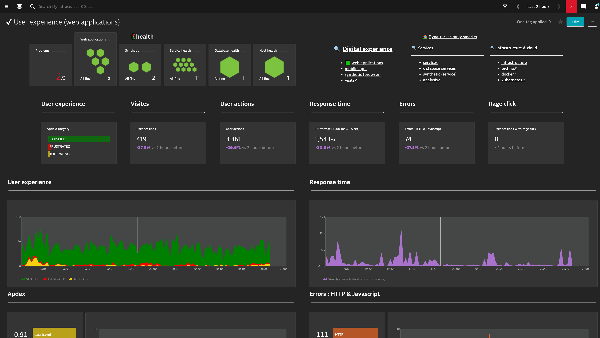
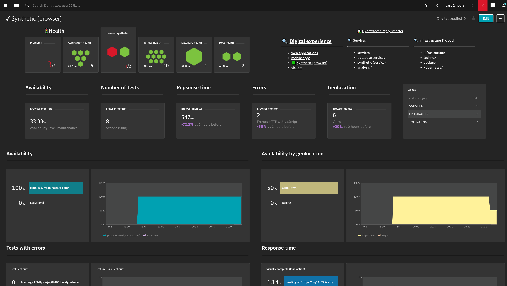
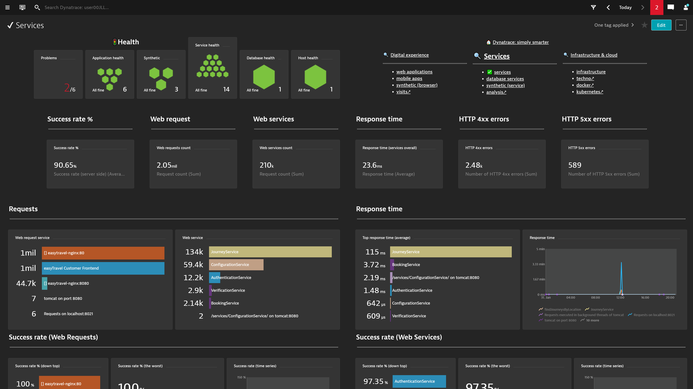
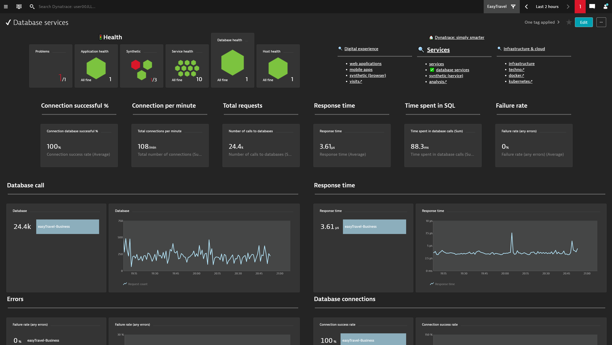
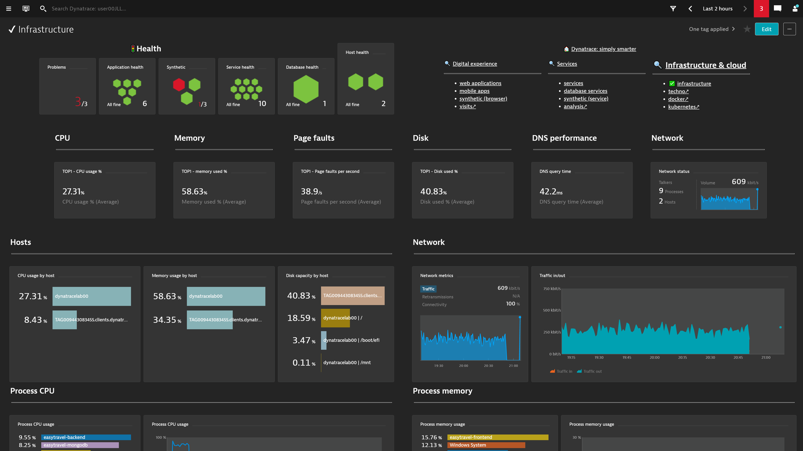

# Dynatrace: simply smarter
Designed by Dynatrace France Services / ELA + JLL

A set of dashboards for beginners or experts, designed to show the main KPI of your applications and services filtered on the management zone.
## Main Dashboard

## Application

## Synthetic

## Services

## Database

## Infrastructure

and so more... :)
