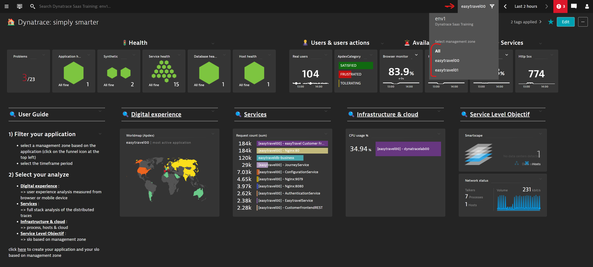
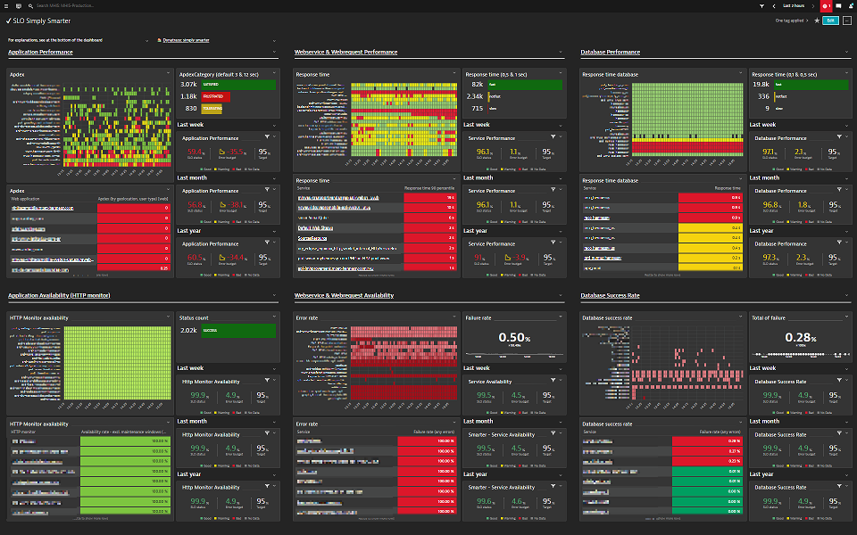
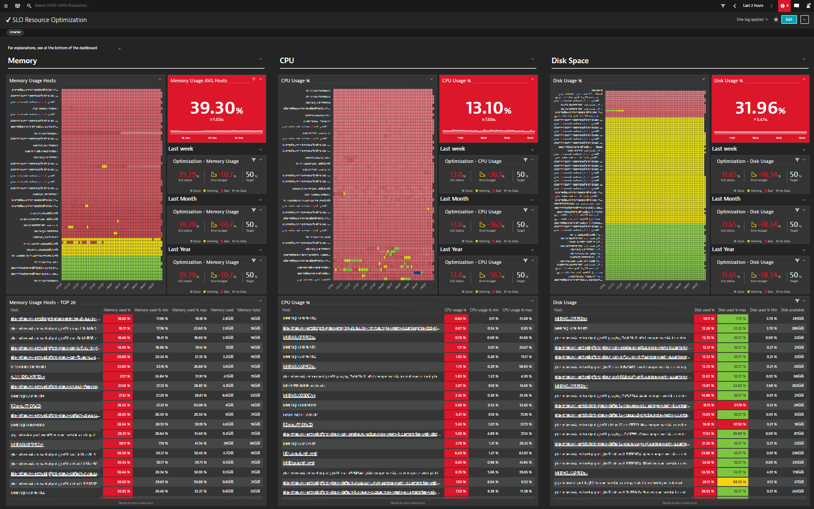
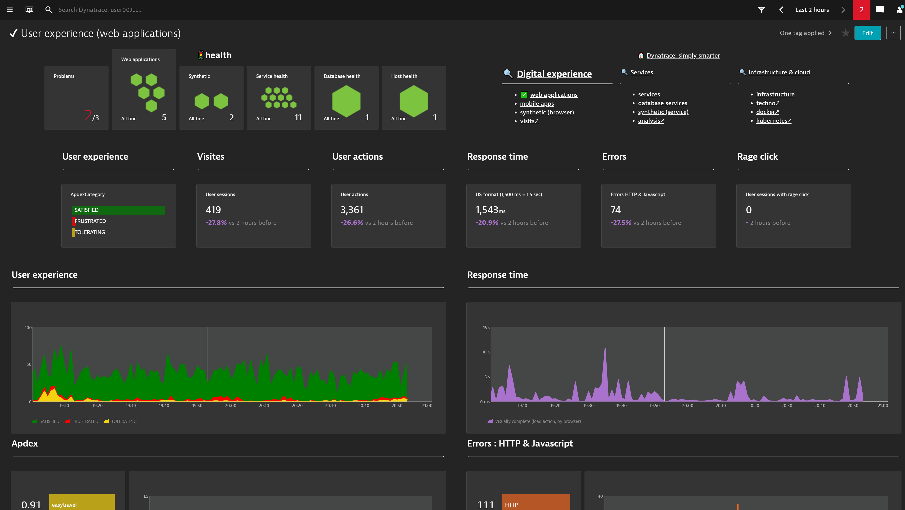
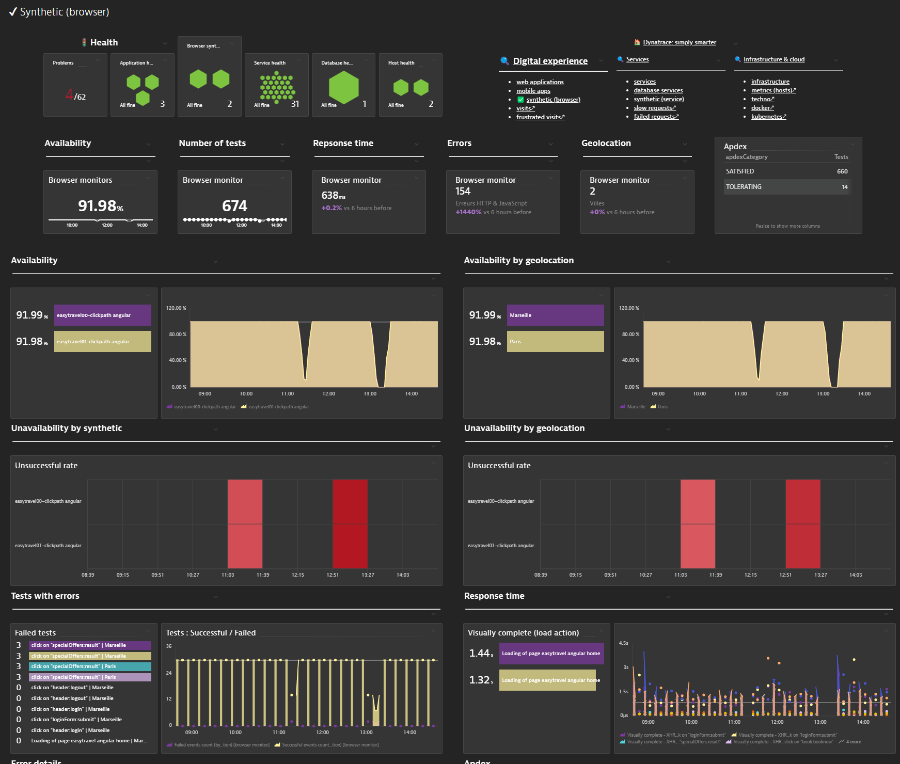
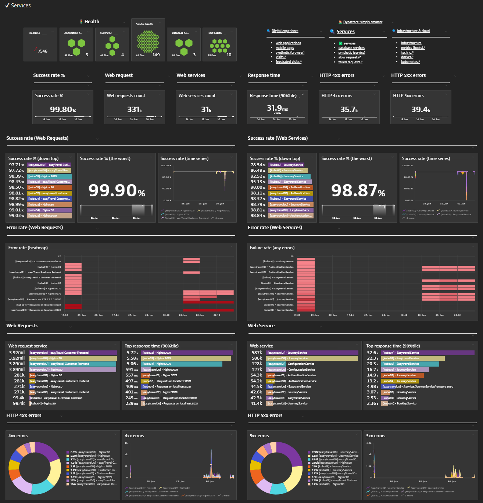
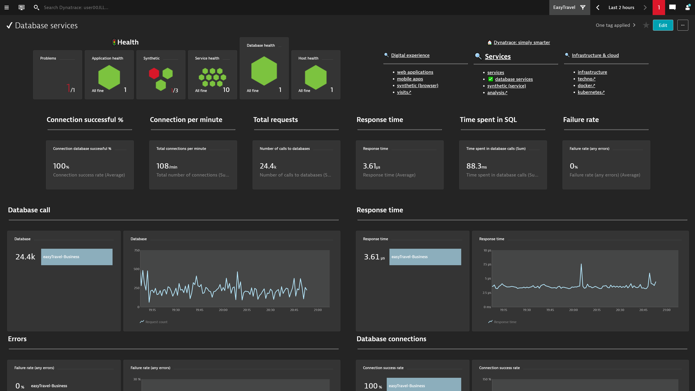
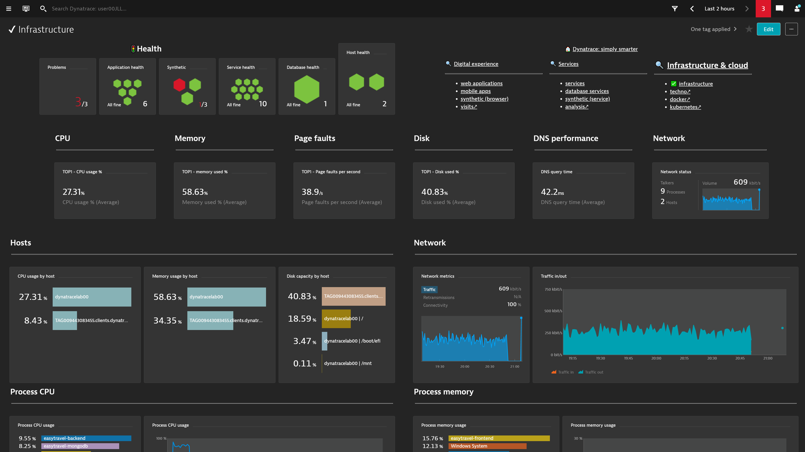
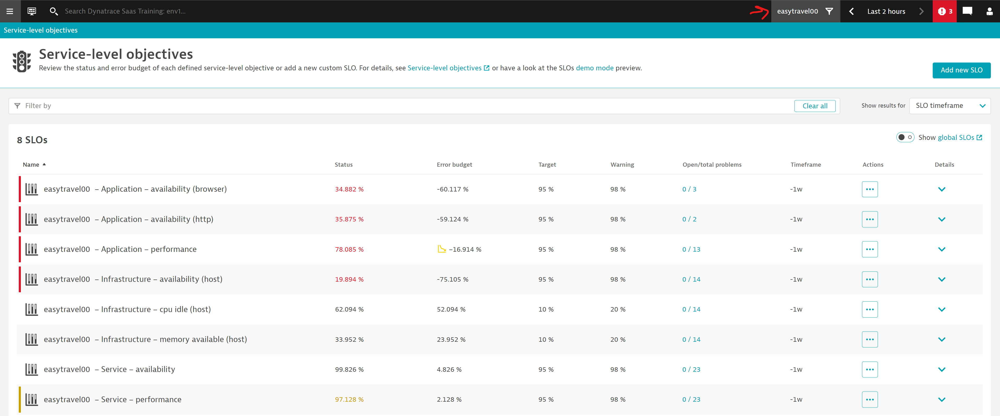

# Dynatrace: simply smarter
Designed by Dynatrace France Services / JLL + JET + ELA
Latest update : 2023/01/02

NEW : SLO Simply Smarter & SLO Resource Optimization
 - for more detail click [here](https://github.com/dynatrace-ace-services/slo-simply-smarter/blob/main/README.md)

A set of dashboards from beginners to experts, designed to show the main KPI of your applications and services filtered on the management zone.
## Main Dashboard

## Project centric => filter by management zone

## SLO Simply Smarter

## SLO Resource Optimization

## Application

## Synthetic

## Services

## Database

## Infrastructure

## SLO

and so more... :)
