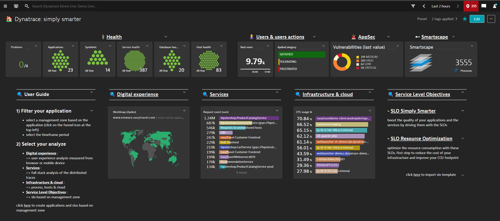
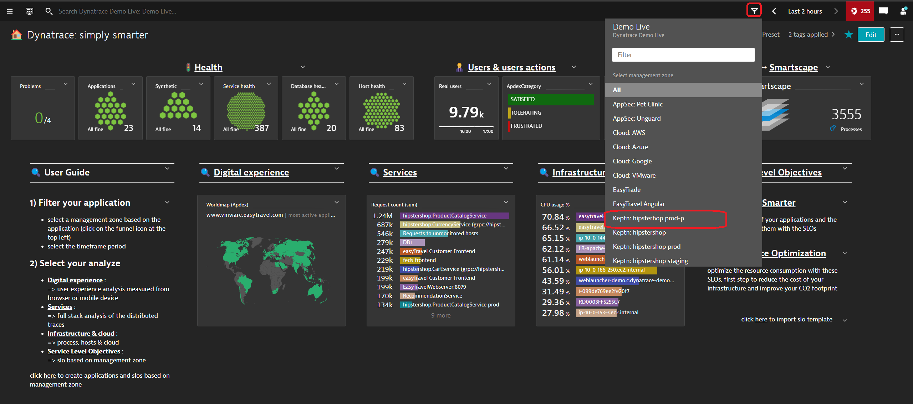

# Dynatrace: simply smarter
Designed by Dynatrace ACE Services France / JLL + ANF + ELA + JET  
Latest update : 2024/01/26

NEW : `SLO Simply Smarter` & `SLO Resource Optimization` 
 - for more detail to the installation and update click [here](https://github.com/dynatrace-ace-services/slo-simply-smarter/blob/main/README.md)

A set of dashboards from beginners to experts, designed to show the main KPI of your applications and services filtered on the management zone.
## Main Dashboard

## Application centric => filter by management zone

## Overview

## SLO Simply Smarter

## SLO Resource Optimization

## Application

## Synthetic

## Services

## Database

## Infrastructure

## SLO

and so more... :)
